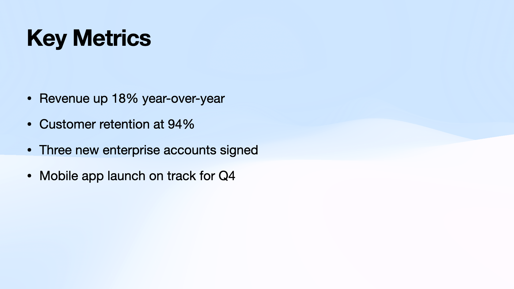

# keynote-cli

A command-line tool for automating Apple Keynote on macOS. Build presentations from scripts, inspect slide structure, export to PDF/PNG/PPTX, insert equations, add hyperlinks, and more — all without touching the GUI.

## Installation

Clone the repo and add it to your PATH:

```bash
git clone https://github.com/your-user/keynote-cli.git ~/Projects/keynote-cli
export PATH="$HOME/Projects/keynote-cli:$PATH"
```

### Requirements

- macOS with Keynote installed
- Python 3.10+
- For GUI scripting commands (`insert-equations`, `insert-links`, `insert-slide-links`): your terminal must be listed under System Settings > Privacy & Security > Accessibility

## Quick start

Create a script file `hello.keynote-script`:

```
open my-template.key --output hello.key
add-slide --master "Title"
set-text --slide 1 --target defaultTitleItem "Hello World"
set-text --slide 1 --target defaultBodyItem "Built with keynote-cli"
save
```

Run it:

```bash
keynote-cli run hello.keynote-script
```

Export to PDF:

```bash
keynote-cli export hello.key
```

### Example: building a presentation from scratch

The [`example.keynote-script`](example.keynote-script) was built using the Dynamic Clouds Light theme. Different masters expose text in different ways — some use `defaultTitleItem`/`defaultBodyItem`, others only have `textItem:N`. Running `inspect-masters` reveals the layout:

```bash
keynote-cli inspect-masters my-template.key
```

```
Master             defaultTitleItem  defaultBodyItem  Other text items
─────────────────  ────────────────  ───────────────  ────────────────
Title              ✓ (1730×366)      ✓ (1730×150)     textItem:1 (1730×50)
Title & Bullets    ✓ (1730×113)      ✓ (1730×650)     textItem:2 (1730×74)
Section            ✓ (1730×366)      —                —
Big Fact           —                 1730×570         textItem:2 (1730×74)
Quote              —                 1644×302         textItem:1 (1591×50)
Statement          —                 1730×305         —
```

For masters like **Title & Bullets**, `defaultTitleItem` and `defaultBodyItem` work directly. But **Big Fact** has no `defaultTitleItem` — the large number is `defaultBodyItem` (or equivalently `textItem:1`) and the subtitle is `textItem:2`. **Quote** is similar: the quote text is `defaultBodyItem` and the attribution line is `textItem:1`.

The resulting script uses these targets:

```
add-slide --master "Big Fact"
set-text --slide 4 --target textItem:1 "4,200"
set-text --slide 4 --target textItem:2 "New users onboarded this quarter"

add-slide --master "Quote"
set-text --slide 5 --target textItem:2 "The best product decisions come from listening to customers."
set-text --slide 5 --target textItem:1 "— Internal retrospective, July 2025"
```

6 slides built in ~5 seconds:

| | |
|---|---|
|  |  |
|  |  |

## Commands

### Standalone commands

```bash
keynote-cli run script.txt                  # Run a script file
keynote-cli run script.txt --check-template # Verify master slides exist first
keynote-cli run script.txt --force          # Overwrite existing output
keynote-cli run script.txt --print-applescript  # Print generated AppleScript

keynote-cli inspect file.key               # Dump slide structure as JSON
keynote-cli inspect-masters file.key       # Dump master slide text item layout

keynote-cli export file.key                # Export to PDF (default)
keynote-cli export file.key --format png   # Export as PNG slide images
keynote-cli export file.key --format pptx  # Export as PowerPoint
keynote-cli export file.key --format movie # Export as QuickTime movie

keynote-cli present file.key               # Start slideshow
keynote-cli present file.key --from 5      # Start from slide 5

# GUI scripting commands (require Accessibility permissions):
keynote-cli insert-links links.json
keynote-cli insert-slide-links nav.json
keynote-cli insert-equations equations.json
```

### Script commands

Scripts are newline-delimited files of commands. Lines starting with `#` are comments.

#### Slide creation

| Command | Description |
|---------|-------------|
| `open TEMPLATE --output OUTPUT [--force]` | Copy template to output, open in Keynote |
| `add-slide --master NAME` | Create slide from named master |
| `save` | Save and close |

#### Text

| Command | Description |
|---------|-------------|
| `set-text --slide N --target TARGET TEXT [--indents 0,1,2]` | Set text on a slide item |
| `set-notes --slide N TEXT` | Set presenter notes |
| `add-text-box --slide N --text TEXT --position X,Y --size W,H [--font F] [--font-size S] [--color R,G,B]` | Add free text box |
| `replace-text --find "X" --replace "Y" [--slide N]` | Find/replace text |
| `set-style --slide N --target TARGET [--bold] [--no-bold] [--italic] [--underline]` | Bold/italic/underline |

#### Images and shapes

| Command | Description |
|---------|-------------|
| `add-image --slide N --file PATH --position X,Y [--size W,H]` | Insert image |
| `add-shape --slide N --position X,Y --size W,H [--text T] [--rotation D] [--opacity O]` | Add shape |
| `add-line --slide N --from X,Y --to X,Y` | Add line |
| `duplicate-shape --slide N --index I --to-slide M` | Copy shape to another slide |
| `delete-shape --slide N --index I` | Delete shape |
| `delete-image --slide N --index I` | Delete image |

#### Slide manipulation

| Command | Description |
|---------|-------------|
| `duplicate-slide --slide N [--to M]` | Duplicate slide |
| `move-slide --slide N --to M` | Move slide to position |
| `skip-slide --slide N` | Hide slide from presentation |
| `unskip-slide --slide N` | Unhide slide |
| `set-master --slide N --master NAME` | Change slide master |
| `delete-slides RANGE` | Delete slides (e.g. `1-7`) |

#### Tables

| Command | Description |
|---------|-------------|
| `add-table --slide N --rows R --cols C [--position X,Y] [--size W,H]` | Add table |
| `set-cell --slide N --row R --col C VALUE [--table I]` | Set cell value |
| `add-row --slide N [--table I]` / `add-col --slide N [--table I]` | Add row/column |
| `delete-row --slide N --row R [--table I]` / `delete-col --slide N --col C [--table I]` | Delete row/column |

#### Document

| Command | Description |
|---------|-------------|
| `override --slide N --target TARGET [--text T] [--position X,Y] [--size W,H] [--font F] [--font-size S] [--color R,G,B] [--opacity O] [--rotation R]` | Modify any element |
| `set-transition --slide N --style TYPE [--duration S]` | Set slide transition |
| `set-theme --theme NAME` | Apply theme to document |

### Target notation

Targets identify slide elements for `set-text`, `override`, and `set-style`:

| Target | Element |
|--------|---------|
| `defaultTitleItem` | Default title placeholder |
| `defaultBodyItem` | Default body placeholder |
| `textItem:N` | Text item by index (1-based) |
| `image:N` | Image by index |
| `shape:N` | Shape by index |

### Text escaping

In script text arguments, use `\n` for newlines, `\t` for tabs, `\\` for literal backslashes. Quote arguments containing spaces with shell quoting (`'...'` or `"..."`).

### Execution order

Slide creation commands (`add-slide`, `set-text`, `add-image`, etc.) execute first in batches. Document-level commands (`duplicate-slide`, `move-slide`, `replace-text`, `add-shape`, `set-master`, `delete-slides`, etc.) execute after all slide creation, in script order.

## Performance

`keynote-cli run` compiles scripts into batched AppleScript (20 slides per `osascript` call). This is fast enough for 150+ slide decks.

## GUI scripting commands

Three commands drive the Keynote GUI via System Events and require the document to be open and frontmost:

- **`insert-equations`** — replaces `[PLACEHOLDER]` tokens with rendered LaTeX equations via Insert > Equation
- **`insert-links`** — finds text via Cmd+F and adds URL hyperlinks via Cmd+K
- **`insert-slide-links`** — selects shapes and adds slide navigation links via Cmd+K

All accept a JSON file, support `--dry-run` and `--print-applescript`, and process entries in batch. See `AGENTS.md` for input formats.

## Notes

- Run one `keynote-cli` command at a time — Keynote scripting is not concurrency-safe.
- Build failures include the failing slide number and master name.
- Shape fill color and slide backgrounds cannot be set via AppleScript. Use `set-master` to switch to a master with the desired background, or `duplicate-shape` to copy pre-styled shapes from a template slide.

## License

MIT
